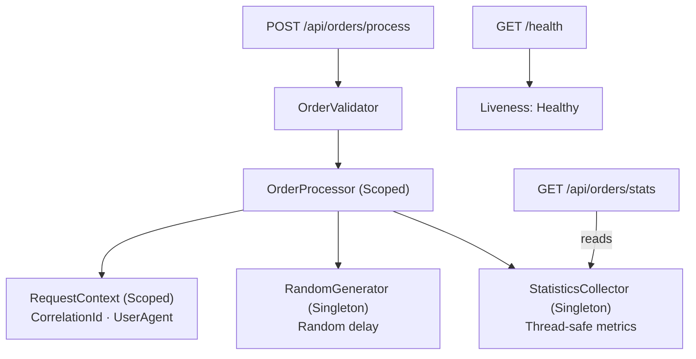

# Order Processing Simulator (.NET 8)

Minimal API demonstrating DI lifetimes, concurrency, and state boundaries.

## Endpoints

- `POST /api/orders/process` — simulate order processing, returns CorrelationId and duration
- `GET /api/orders/stats` — returns total orders, average duration, last 5 durations
- `GET /health` — liveness check

## Service Lifetime Decisions

| Service | Lifetime | Reason |
|---|---|---|
| `RequestContext` | Scoped | Holds per-request data (CorrelationId, UserAgent). Must be isolated per request. |
| `OrderProcessor` | Scoped | Depends on RequestContext. Captive dependency if Singleton. |
| `StatisticsCollector` | Singleton | Accumulates application-wide metrics. Must survive across requests. |
| `OrderMetrics` | Singleton | Owns thread-safe, application-wide metric instruments created once. |
| `RandomGenerator` | Singleton | Stateless. Uses `Random.Shared` — thread-safe since .NET 6. |

## Runtime Flow



## Project Structure

```
OrderProcessing.Api/
  Contracts/           # Request/response records and configuration options
  DependencyInjection/ # Service registration
  Endpoints/           # Minimal API endpoint mappings
  Services/            # Processing, request context, statistics, randomization, and metrics
  Validation/          # OrderValidator
  Program.cs           # Application composition and middleware pipeline

OrderProcessing.Api.Tests/
  OrderApiSpecs.cs            # Integration tests — HTTP end-to-end
  ServiceLifetimeSpecs.cs     # DI lifetime verification
  BugDemoSpecs.cs             # Intentional bug demonstration and fix
  StatsEdgeCaseSpecs.cs       # Input validation and zero-stats baseline
  RateLimitAndHealthSpecs.cs  # Rate limiting, health check, concurrency
  OrderMetricsSpecs.cs        # Custom metric measurements and outcome tags
  OrderProcessorSpecs.cs      # Success, cancellation, and failure outcomes
```

## Observability

- `GET /health` provides a liveness signal.
- Structured logs include `CorrelationId` and `OrderId` through an `ILogger` scope.
- Every response includes `X-Correlation-ID`, allowing callers to match a response to server logs.
- `System.Diagnostics.Metrics` instruments processing count and duration, tagged by the
  low-cardinality `outcome` values `success`, `cancelled`, and `failed`.

No telemetry exporter is configured because the assignment has no monitoring backend.
In production, OpenTelemetry could collect the custom meter and export it through OTLP
or expose it to Prometheus.

## Run

```bash
dotnet test OrderProcessingApi.sln
dotnet run --project OrderProcessing.Api/OrderProcessing.Api.csproj
# Swagger UI: https://localhost:{port}/swagger
```

---

## Q&A

### 1. Why is RequestContext not Singleton?

RequestContext holds data unique to a single HTTP request: CorrelationId, UserAgent, and StartTime.
All properties are set once in the constructor and never change (immutable).
If registered as Singleton, one instance would be shared across all concurrent requests —
all requests would carry the CorrelationId and UserAgent captured when the Singleton was first resolved.
Request A and Request B would be indistinguishable in logs.
In a system with UserId, this would be a critical security vulnerability:
User A could see User B's data.

It must be Scoped so each request gets its own isolated instance, bound to the HttpContext lifecycle.

### 2. When is Singleton dangerous?

Singleton is dangerous in two scenarios:

**Shared mutable state without synchronization:**
Multiple concurrent requests write to the same object simultaneously, causing race conditions.
Example: two threads both read `total=5`, both write `total=6` — one increment is lost.
Solution: use `lock` to ensure atomic updates across related fields.

**Captive Dependency:**
A Singleton captures a Scoped dependency in its constructor. The Scoped object is never released —
it lives for the entire application lifetime instead of per request.
ASP.NET Core throws `InvalidOperationException` in Development (`ValidateScopes=true`),
but is silently broken in Production (`ValidateScopes=false`).

### 3. When is Transient wasteful?

When an object is expensive to construct and resolved multiple times within the same request.
Each resolution creates a new instance — unnecessary allocations and GC pressure.
For stateless, lightweight services Transient is fine.
For services resolved repeatedly in the same pipeline, Scoped is more efficient.

### 4. What bug surprised you most?

The RequestContext-as-Singleton bug. The most insidious aspect was that it bypassed ASP.NET Core's
built-in scope validation entirely. Because a Singleton is technically resolvable from anywhere,
the framework did not throw at startup. The application launched cleanly but silently shared the
same CorrelationId and UserAgent across entirely different incoming requests.

This highlights why validating container registrations in automated tests is critical —
`BugDemoSpecs` proves the bug with `Assert.Same` and catches the fix with `Assert.NotSame`,
catching silent state bleeding before it reaches production.
